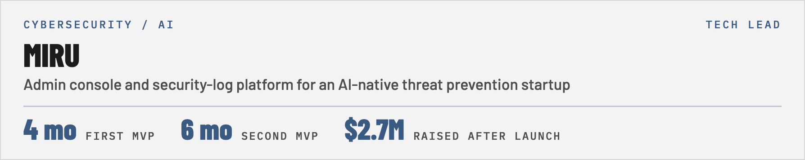
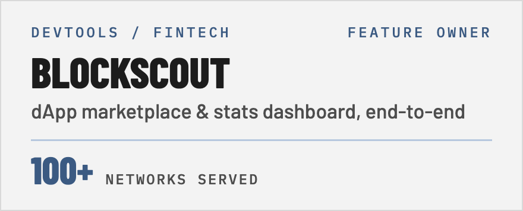
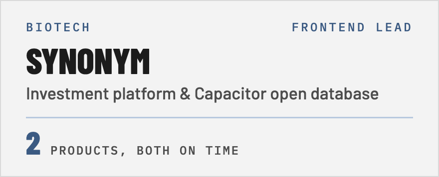
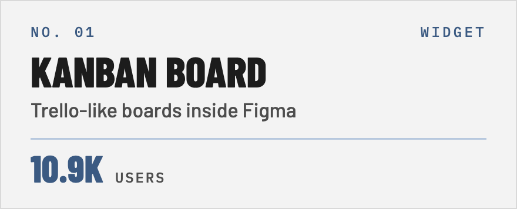
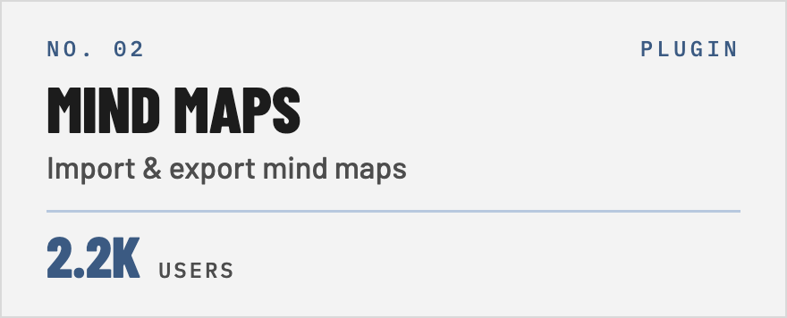
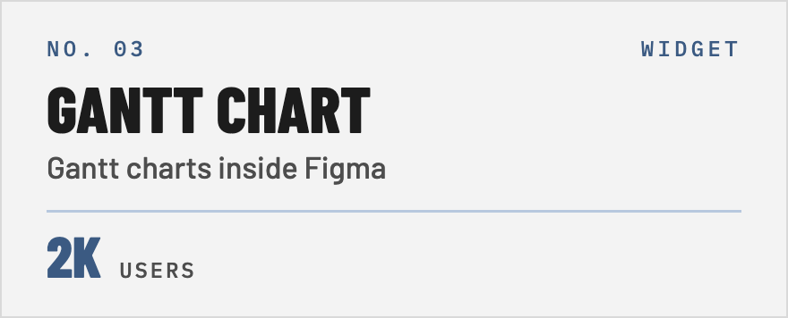
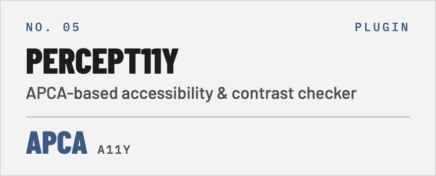
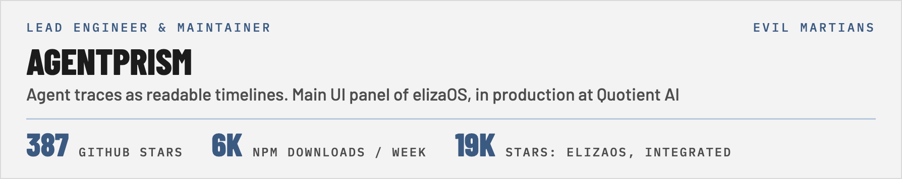
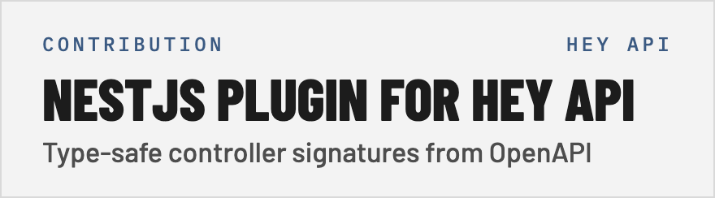
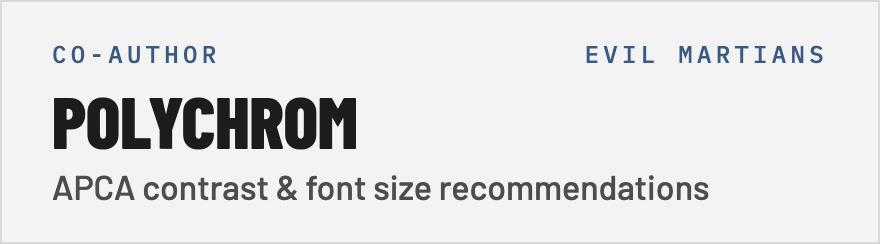

<picture>
  <source media="(prefers-color-scheme: dark)" srcset="assets/hero-dark.png">
  
</picture>

Lately my job looks less like frontend engineering and more like being someone's CTO. A founder shows up with an idea and an empty repository, and I turn it into a live product: I choose the stack, design the architecture, define the scope, plan the releases, and write the code.

[Evil Martians profile](https://evilmartians.com/martians/yuri-mikhin) · [Figma Community](https://figma.com/@yurimikhin) · [X](https://x.com/yurimikhin)

## Client work

<a href="https://evilmartians.com/clients/miru-labs"><picture><source media="(prefers-color-scheme: dark)" srcset="assets/client-miru-dark.png"></picture></a>
<a href="https://evilmartians.com/clients/blockscout"><picture><source media="(prefers-color-scheme: dark)" srcset="assets/client-blockscout-dark.png"></picture></a>
<a href="https://evilmartians.com/clients/synonym"><picture><source media="(prefers-color-scheme: dark)" srcset="assets/client-synonym-dark.png"></picture></a>

## Figma plugins &amp; widgets — 20K+ users

<a href="https://www.figma.com/community/widget/1351833308415153127/kanban-board-trello-like"><picture><source media="(prefers-color-scheme: dark)" srcset="assets/plugin-kanban-dark.png"></picture></a>
<a href="https://www.figma.com/community/plugin/1542146994098256095/figma-mind-map-importer-exporter-plugin"><picture><source media="(prefers-color-scheme: dark)" srcset="assets/plugin-mindmaps-dark.png"></picture></a>
<a href="https://www.figma.com/community/widget/1655733687866006888/gantt-chart"><picture><source media="(prefers-color-scheme: dark)" srcset="assets/plugin-gantt-dark.png"></picture></a>
<a href="https://www.figma.com/community/plugin/1563568797363678258/comments-mover-pages-coming-soon"><picture><source media="(prefers-color-scheme: dark)" srcset="assets/plugin-comments-dark.png"></picture></a>
<a href="https://www.figma.com/community/plugin/1636745379895311011/percept11y-accessibility-contrast-checker"><picture><source media="(prefers-color-scheme: dark)" srcset="assets/plugin-percept11y-dark.png"></picture></a>
<a href="https://www.figma.com/community/widget/1554482530759515936/dynamic-connector-formula"><picture><source media="(prefers-color-scheme: dark)" srcset="assets/plugin-connector-dark.png"></picture></a>

## Open source

<a href="https://evilmartians.com/opensource/agent-prism"><picture><source media="(prefers-color-scheme: dark)" srcset="assets/oss-agentprism-dark.png"></picture></a>
<a href="https://heyapi.dev/openapi-ts/plugins/nest"><picture><source media="(prefers-color-scheme: dark)" srcset="assets/oss-heyapi-dark.png"></picture></a>
<a href="https://github.com/evilmartians/figma-polychrom"><picture><source media="(prefers-color-scheme: dark)" srcset="assets/oss-polychrom-dark.png"></picture></a>

## Featured articles

