<picture>
  <source media="(prefers-color-scheme: dark)" srcset="assets/hero-dark.png">
  
</picture>

<a href="https://www.figma.com/community/widget/1351833308415153127/kanban-board-trello-like">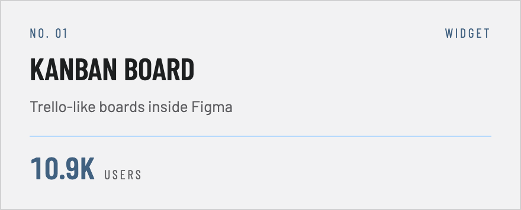</a>
<a href="https://www.figma.com/community/plugin/1542146994098256095/figma-mind-map-importer-exporter-plugin">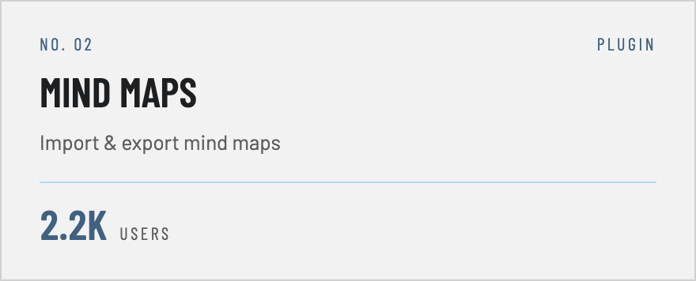</a>
<a href="https://www.figma.com/community/widget/1655733687866006888/gantt-chart">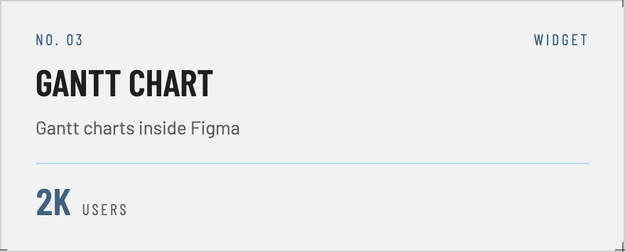</a>
<a href="https://www.figma.com/community/plugin/1563568797363678258/comments-mover-pages-coming-soon">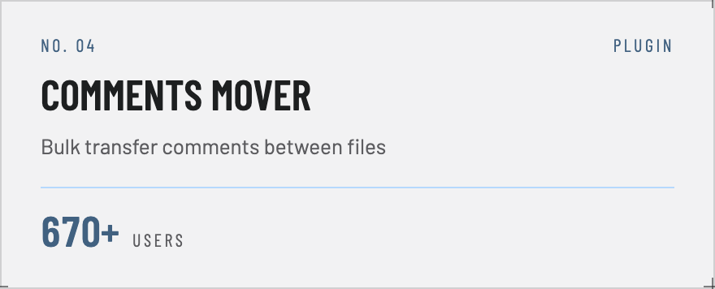</a>
<a href="https://www.figma.com/community/plugin/1636745379895311011/percept11y-accessibility-contrast-checker">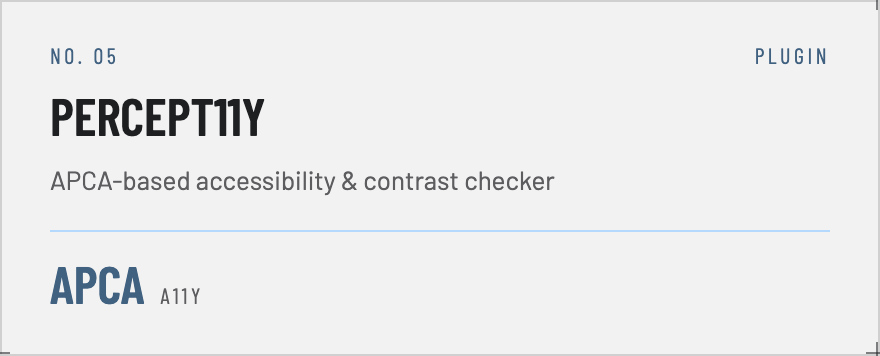</a>
<a href="https://www.figma.com/community/widget/1554482530759515936/dynamic-connector-formula">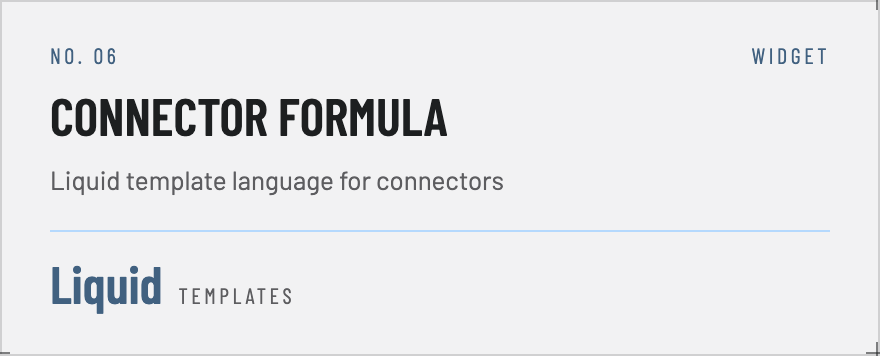</a>

<a href="https://heyapi.dev/openapi-ts/plugins/nest">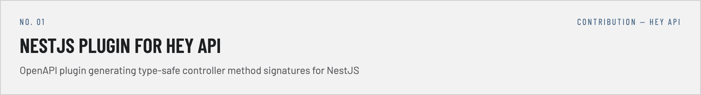</a>

<a href="https://evilmartians.com/opensource/agent-prism">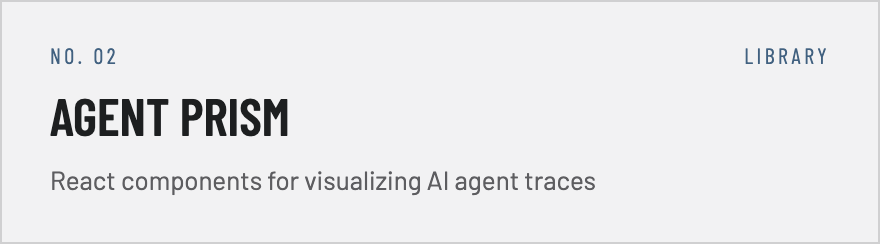</a>
<a href="https://github.com/evilmartians/figma-polychrom">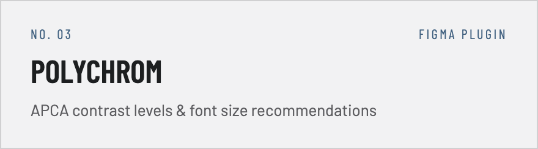</a>
<a href="https://github.com/mikhin/figma-plugin-boilerplate">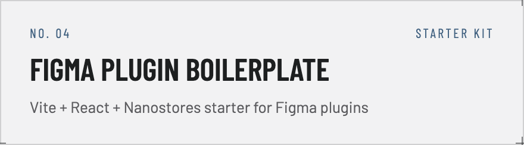</a>
<a href="https://github.com/mikhin/figma-widget-vite-react-typescript-template">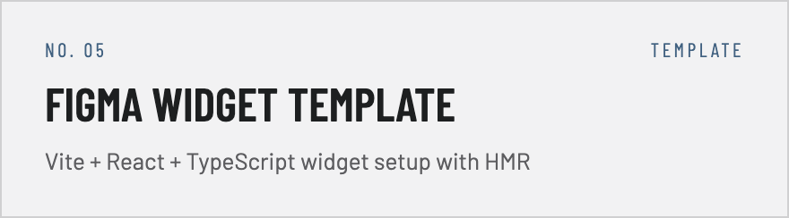</a>
<a href="https://github.com/mikhin/contact-picker-api-demo">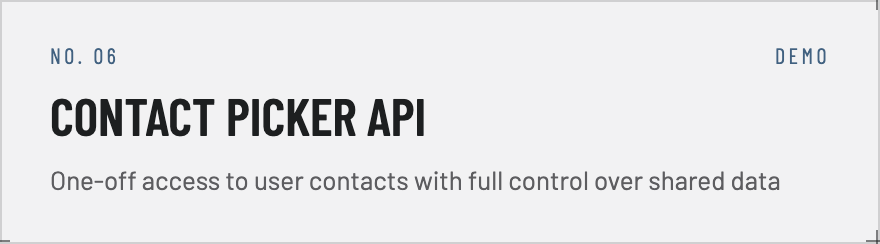</a>
<a href="https://github.com/mikhin/madge-path-filter">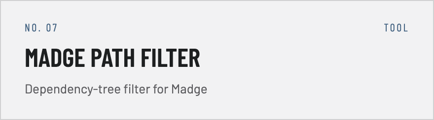</a>
